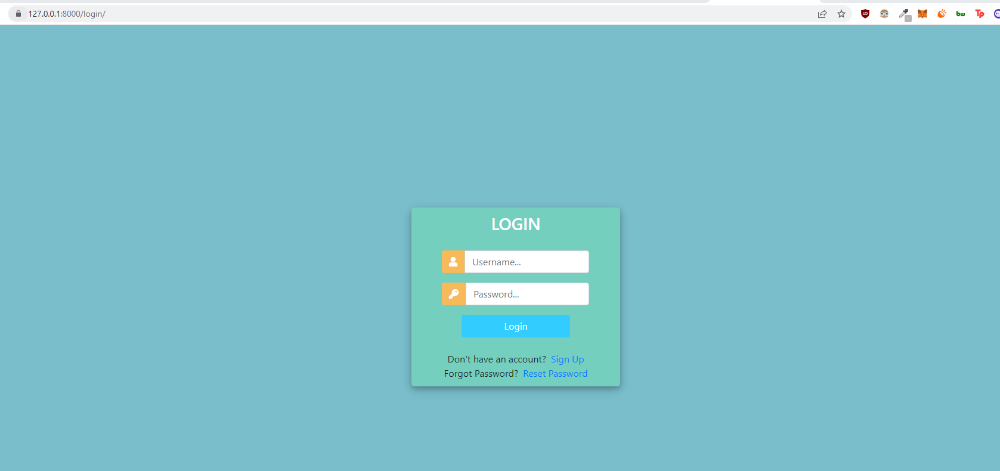
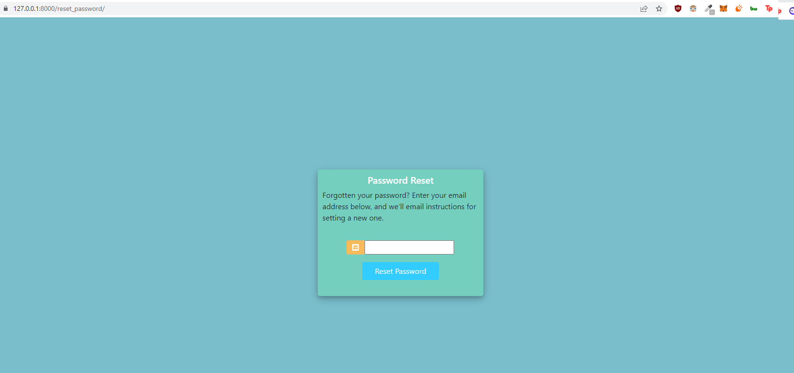
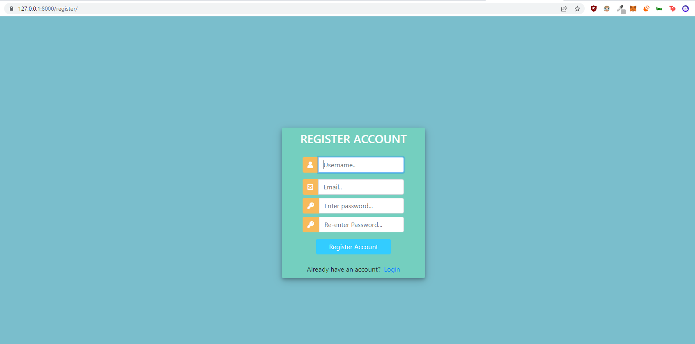
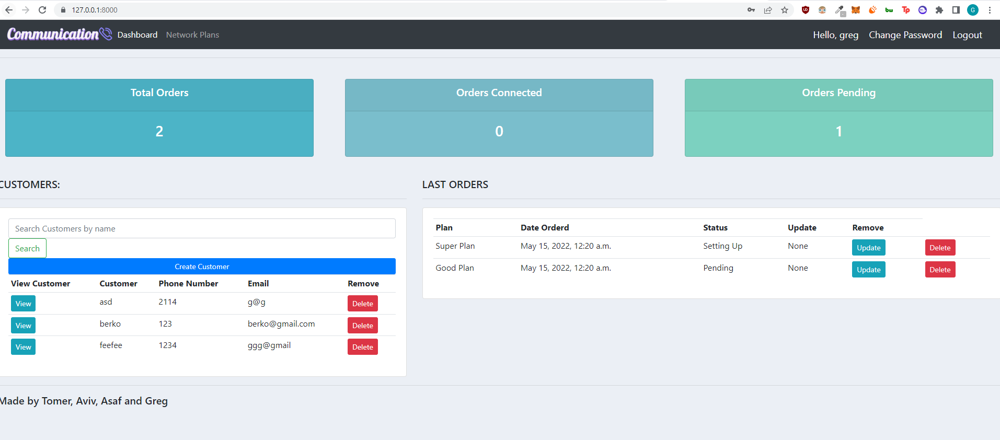
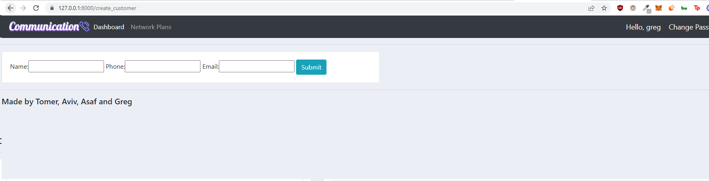
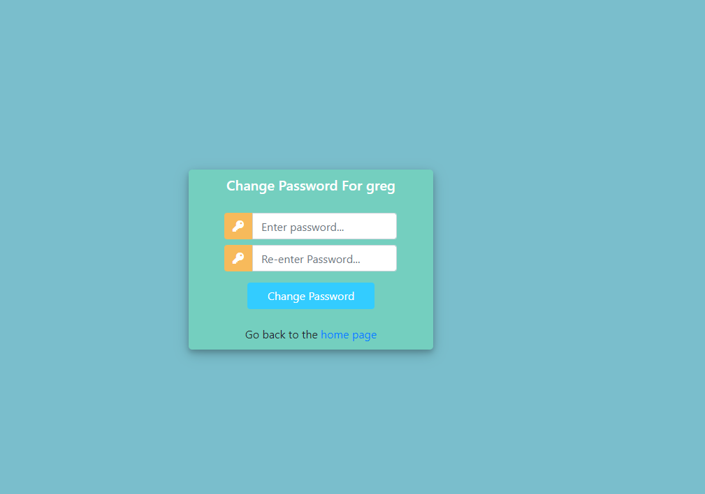
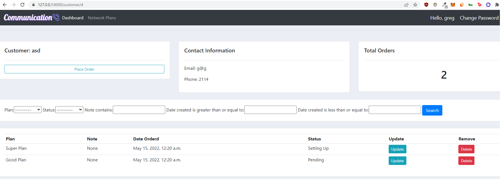

# Computer Security Final Project

This project is a dummy telecommunication site that is vulnerable to SQL injection and XSS attacks. This was made to demonstrate the power of those attack vector. 

Users can add customers(and see only the customers they added), add orders to these customers and manage orders.

By: 
Greg Alelov
Aviv Aharon
Tomer Berkovich
Asaf Elazar

## How to install?

1. Clone the GitHub repository to your local machine (or choose the tag you will to download)

2. Install the required dependencies. Run the following: `pip install -r requirements.txt`

3. Install MySQL server that will host all the data.

4. In the code, go to the view.py and settings.py files and change the following sections to match your settings:

   ```python
   'NAME': 'communication',
   'USER': 'root',
   'PASSWORD': '1234',
   ```
   (U can also uncomment the sqlite DATABASE credentials to use it quickly without setting up a mysql server[and get some dummy db entries])

5. Migrate all the DBs `python manage.py makemigrations` and then `python manage.py migrate`

6. Run the server: 
- Without TLS (get the v3.0 tag): `python manage.py runserver` and go to http://127.0.0.1:8000/
- With TLS (get the v3.1 tag): `python manage.py runsslserver --certificate cert.crt --key key.key` and go to https://127.0.0.1:8000/

## Touble Shooting
- If you try to reset your password and you don't see an email please check your Spam inbox.
- After changing the pass.json conf file, you need to rerun the server inorder for the changes to apply.
- HTTPS might take some time to reload. Be patient. 
- If the HTTPS version doesn't load properly (Time out error), try to delete your browser cookies.
- If you don't see plans you can make one through the db or using the admin panel in https://127.0.0.1:8000/admin

## Vulenrable fields
- To turn on the vulenrable version of the website you need to change secure = True to secure = False in views.py
### XSS
- https://127.0.0.1:8000/update_order/[order.id]
Use `example@gmail.com</td><script>alert("You've been hacked")</script><td>` in "Note" when updating an order
### SQL injection
- http://127.0.0.1:8000/ and any other view, the vulnerable field is the 'Customer Search' bar, use '%'#' in the search bar to inject

## STRIDE Analysis

You can find all the vulnerabilites in the attached PDF file on the root dir

**Login Attempts Failed** - If a user fails to Login 3 times or more during 300 seconds, his user will be locked for 100 seconds

**Config** - pass.json is the config file for passwords, lock time limit, lockdown time and more(You can edit it freely, you have to restart the server for the changes to take place)

**Password Reset** - A user can reset his password using his email, he'll get a unique url to reset his password(The user cannot use passwords he used in the past, you can edit the number of past passwords saved in the config file, pass.json)

**Change Password** - Users can change their password 

**TLS protected**- The app can be used using TLS 1.3(The certificate was generated using mkcert)

**XSS Vulenrability**- We made the some fields vulnerable to the XSS attack vector

**DREAD analysis**- We analyzed each vulnerabily using this model in the PDF file

## Requirements

- Python3
- Pip3
- MySQL server

## Screenshots:
- Login page:


- Password Reset:


- Sign up/Register:


- User Dashboard:


- Create Customer:


- Change Password


- View customer and manage orders:



